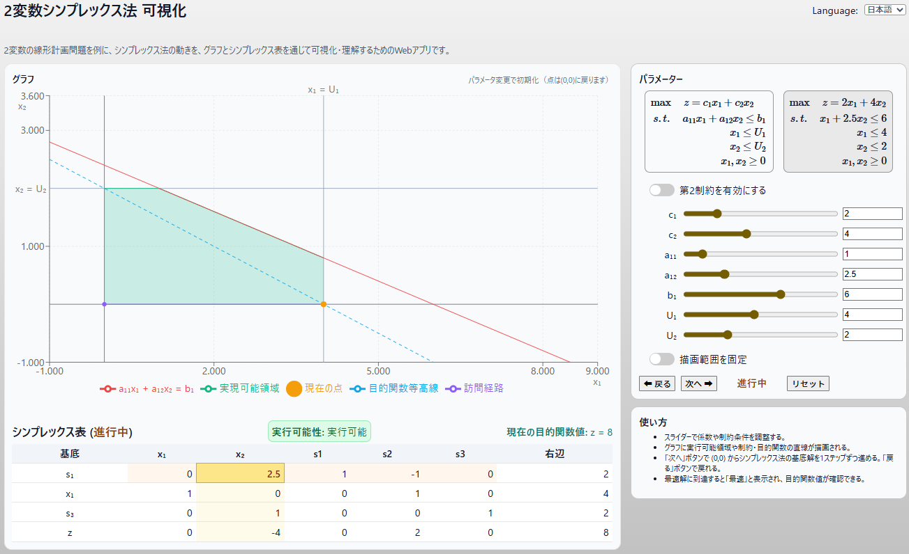
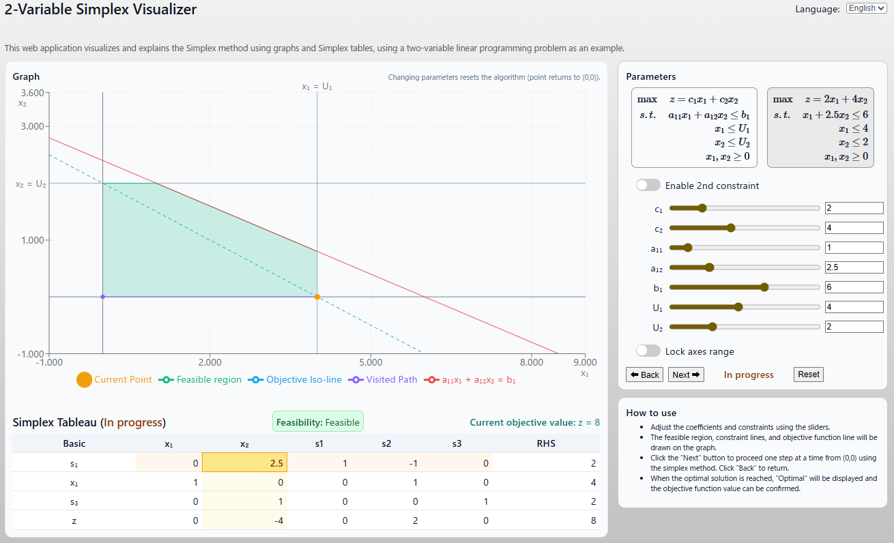

#### [English](#english) | [日本語](#日本語)
### 日本語
# 2変数シンプレックス法 可視化アプリ

このアプリは、2変数の線形計画問題を対象に、シンプレックス法の動きを **グラフ** と **シンプレックス表** を用いて視覚的に理解するための Web アプリです。

### 概要



- Bland の規則 を用いた逐次的な単体法の実行
- スライダーによるパラメータ操作（変更するとアルゴリズムはリセット）
- 実行可能領域の可視化
- ステップごとの単体表の表示

### 使い方

1. スライダーで目的関数や制約条件の係数を変更します。
2. グラフに実行可能領域、制約直線、目的関数の等高線が描画されます。
3. **「次へ」** ボタンで (0,0) からシンプレックス法を1ステップずつ進めます。**「戻る」** ボタンで戻れます。
4. 最適解に到達すると **「最適」** と表示され、目的関数値が確認できます。

### デモ

[プログラムの使用例(Webアプリ)](https://tanaken-basis.github.io/simplex-visualizer/) で実際の挙動を確かめることができますのでご覧ください。

### インストールと実行

```bash
# 依存パッケージのインストール
npm install

# 開発サーバーの起動
npm run dev
```

---
#### [English](#english) | [日本語](#日本語)
### English
# 2-Variable Simplex Visualizer
This web app helps visualize the **Simplex method** for two-variable linear programming problems, using **graphs** and the **simplex tableau**.

- Step-by-step simplex iterations using Bland's rule
- Parameters adjustable with sliders (reset on change)
- Feasible region visualization
- Simplex tableau shown at each step

### How to Use



1. Adjust coefficients of the objective function and constraints with sliders.
2. The graph will display the feasible region, constraint lines, and the objective function iso-line.
3. Click **“Next”** to proceed step by step from (0,0) with the simplex method. Click **“Back”** to go backwards.
4. When the optimal solution is reached, **“Optimal”** is displayed along with the objective value.

### Demo

Check out the [example of program usage](https://tanaken-basis.github.io/simplex-visualizer/) to see how it works.

### Installation & Run

```bash
# Install dependencies
npm install

# Start dev server
npm run dev
```
